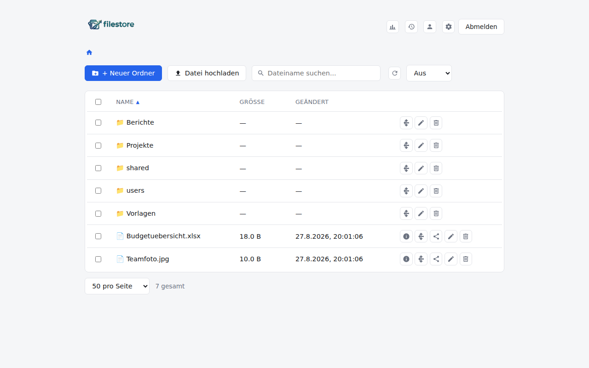

# filestore

A self-hosted, MinIO-backed file manager with a clean web UI: browse, upload,
share and organize files in your own S3-compatible bucket, with local or
OIDC/OAuth login, mobile-friendly browsing, and admin tooling for users,
SMTP and activity auditing.



## Features

- **Local + OIDC/OAuth login** — plug in any generic OIDC provider (Keycloak,
  Authentik, Auth0, ...) alongside the built-in local admin account. Only a
  locally-authenticated admin can change OAuth settings.
- **File browsing & management** — folders, upload (drag & drop), rename,
  move, delete, with per-file **owner tracking** that survives rename/move.
- **Sharing** — generate a share link with optional expiry, optional inline
  preview (skips straight to download when disabled), a QR code, and the
  ability to email the link to multiple recipients (each gets their own
  email, sent from your configured SMTP account).
- **Admin tools** — user management, SMTP settings with test-email, bucket
  configuration, and a paginated, filterable **activity log**.
- **Mobile-responsive UI** — collapsible action menus, an info popover for
  file details, and pagination (25/50/100/all) for both file listings and
  the activity log.
- **Sortable listings** by name, size, or modification date.
- **Multi-language** UI (German/English).

## Requirements

- Docker & Docker Compose
- An existing MinIO (or other S3-compatible) server and bucket

## Quick start

1. Copy the example environment file and fill in your MinIO connection
   details and a session secret:

   ```bash
   cp .env.example .env
   ```

   | Variable | Description |
   | --- | --- |
   | `MINIO_ENDPOINT` | Hostname of your MinIO/S3 server |
   | `MINIO_PORT` | Port (usually `9000`) |
   | `MINIO_USE_SSL` | `true`/`false` |
   | `MINIO_ACCESS_KEY` / `MINIO_SECRET_KEY` | Credentials for that server |
   | `MINIO_BUCKET` | Bucket name, only used to seed the in-app setting on first startup |
   | `AUTH_USERNAME` / `AUTH_PASSWORD` | Bootstrap credentials for the first local admin account |
   | `SESSION_SECRET` | Random string used to sign session cookies, e.g. `openssl rand -hex 32` |
   | `COOKIE_SECURE` | Set to `true` once served over HTTPS |

2. Start it:

   ```bash
   docker compose up -d
   ```

   This builds the backend and frontend images locally. To instead run the
   published images from GHCR, use `docker-compose.prod.yml`:

   ```bash
   docker compose -f docker-compose.prod.yml up -d
   ```

3. Open the app (default port `8081`) and log in with `AUTH_USERNAME` /
   `AUTH_PASSWORD`. On first login as admin you'll be guided through a short
   setup wizard to confirm the bucket configuration.
4. Optionally, as the local admin, configure OAuth login and SMTP under
   **Settings**.

Data (the app's own SQLite database — sessions, shares, activity log, etc.)
is persisted in `./data`, bind-mounted into the backend container.

## Development

```bash
# Backend
cd backend
npm install
DATA_DIR=./data MINIO_ENDPOINT=... MINIO_PORT=... MINIO_ACCESS_KEY=... \
  MINIO_SECRET_KEY=... MINIO_BUCKET=... AUTH_USERNAME=admin AUTH_PASSWORD=... \
  SESSION_SECRET=devsecret npm run dev

# Frontend (proxies /api to the backend above via vite.config.js)
cd frontend
npm install
npm run dev
```

## Building & publishing images

`docker-build.sh` builds both images and pushes them to GHCR under a
date-based version tag (`yyyy.mm.dd-buildid`), also tagging `latest`. The
`build-and-push` GitHub Action (see `.github/workflows/`) does the same
automatically on push to `main`.

## License

MIT — see [LICENSE](LICENSE).

See [CHANGELOG.md](CHANGELOG.md) for release notes.
